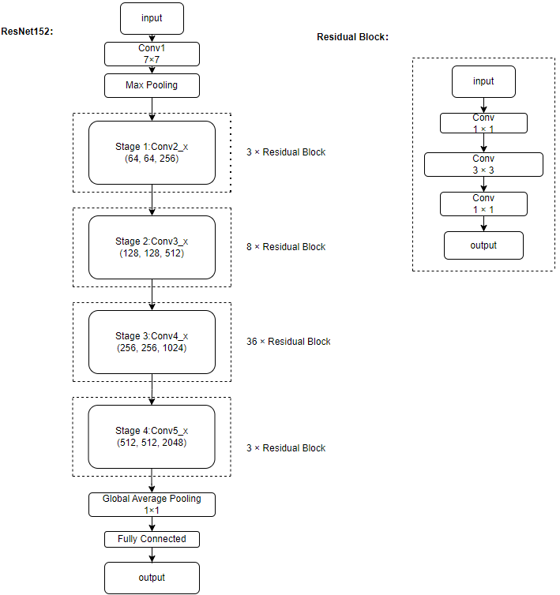

<div align="center">

# ThyroAssist

</div>

---

## 项目介绍
ThyAssist(Thyroid Auxiliary Diagnostic Assistant)是一个跨平台的基于深度学习的甲状腺癌诊断系统。该系统能实现超声影像检测和显微镜下的甲状腺结节穿刺细胞的癌变检测，覆盖了甲状腺癌诊断的全流程。系统主要基于图像进行全局检测，也可以基于由fiji imagej软件采的的细胞特征进行单个细胞的检测。

 **超声影像分析模块** 采用深度学习与传统机器学习结合，人工检测和计算机辅助检测相结合的形式，首先使用UNet++网络分割出结节所在区域，再使用多个支持向量机和人工检测，对结节进行TI-RADS辅助评级，并生成文本形式的诊断建议。该模块架构如下：


<p align="center">
  
</p>


 **病理影像分析模块** 使用ResNet152网络对显微镜下的甲状腺结节细针穿刺细胞进行深度特证提取，判断影像中的细胞为癌细胞还是正常细胞。ResNet152网络结构：

<p align="center">
  
</p>


 **单细胞特征分析模块**使用多层感知机对fiji imagej软件所采集的细胞特征进行识别，输入一个.csv文件，输出模型预测的其中的癌细胞的数量 

---

## 软件架构

```
./ThyroAssist/
    ├── architecture1.png
    ├── launcher.py
    ├── MANIFEST.in
    ├── post_uninstall.py
    ├── README.md
    ├── requirements.txt
    ├── ResNet152.png
    ├── scripts
    │   ├── nested_unet_ultrasound_image_infer_demo.sh
    │   ├── orangepi
    │   │   ├── CANN_installer.sh
    │   │   ├── mindspore_installer.sh
    │   │   └── preparation.sh
    │   ├── pylint_check.sh
    │   ├── resnet_pathological_image_classification_demo.sh
    │   ├── single_cell_infer_demo.sh
    │   ├── train_nested_unet_and_save_checkpoints.sh
    │   ├── train_resnet_and_save_checkpoints.sh
    │   └── unet_ultrasound_image_infer_demo.sh
    ├── setup.py
    ├── thyassist
    │   ├── demo
    │   │   ├── clear_files.py
    │   │   ├── download_use_case.py
    │   │   ├── __init__.py
    │   │   ├── nested_unet_ultrasound_image_infer.py
    │   │   ├── resnet_pathological_image_classification.py
    │   │   └── single_cell_infer.py
    │   ├── image_processor
    │   │   ├── image_utils.py
    │   │   └── __init__.py
    │   ├── __init__.py
    │   └── machine_learning
    │       ├── configuration.py
    │       ├── config.yaml
    │       ├── dataloader
    │       │   ├── download_mlp_data.py
    │       │   ├── download_resnet_data.py
    │       │   ├── download_segmentation_data.py
    │       │   ├── __init__.py
    │       │   ├── load_mlp_data.py
    │       │   ├── load_resnet_data.py
    │       │   ├── load_segmentation_data.py
    │       │   └── load_svm_data.py
    │       ├── __init__.py
    │       ├── loss.py
    │       ├── lr_generator.py
    │       ├── networks
    │       │   ├── cell_sort_mlp.py
    │       │   ├── __init__.py
    │       │   ├── nested_unet.py
    │       │   ├── resnet.py
    │       │   └── unet.py
    │       ├── resnet_configuration.py
    │       └── utils.py
    └── train_and_eval
        ├── __init__.py
        ├── mlp
        │   ├── infer_mlp.py
        │   ├── __init__.py
        │   └── train_and_eval_mlp.py
        ├── resnet
        │   ├── __init__.py
        │   └── train_and_eval_resnet.py
        ├── segmentation
        │   ├── eval_and_infer_nested_unet.py
        │   ├── __init__.py
        │   └── train_nested_unet.py
        └── svm
            ├── __init__.py
            ├── judge_echo_intensity_model_trainer.py
            ├── judge_microcalcification_model_trainer.py
            └── judge_solidity_model_trainer.py
```

---

## 安装教程

### 1.  安装Anaconda3
 **以下两种方法二选一：** 

Anaconda3官方下载地址：https://www.anaconda.com/download 根据用户操作系统进行安装

清华镜像源下载地址：https://mirrors.tuna.tsinghua.edu.cn/anaconda/archive/ 根据用户操作系统选择合适的版本进行安装

安装完成后，创建Python版本为3.9-3.11的conda环境

```
conda create -n myenv python=3.11  # 这里以创建Python3.11的环境为例，"myenv"可换成其他名称
```

### 2.  安装Git

 **对于Windows：** 

Git官方下载地址：https://git-scm.com/downloads  选择Windows版进行安装（速度极慢，不推荐）

清华镜像源下载地址：https://mirrors.tuna.tsinghua.edu.cn/github-release/git-for-windows/git/Git%20for%20Windows%20v2.48.1.windows.1 选择合适的版本进行安装（速度较快，推荐）

 **对于linux**

输入如下命令：

```
sudo apt update
sudo apt install git
```
 **对于Mac** 

输入如下命令

```
brew -v
/bin/bash -c "$(curl -fsSL https://raw.githubusercontent.com/Homebrew/install/HEAD/install.sh)"
brew install git
```

### 3.  安装ThyroAssist

输入如下命令：

```
git clone https://github.com/ShangJingLi/ThyroAssist.git
cd ThyroAssist
conda activate myenv  # "myenv"是希望安装本项目的环境
pip install .
```

以上命令也可简化为：
```
conda activate myenv
pip install git+https://github.com/ShangJingLi/ThyroAssist.git
```


 _注意：以上安装方式仅支持CPU，若需使用NVIDIA GPU加速，请安装CUDA、CUDNN和TensorRT_ 

---

## 使用说明

### 1.  检验是否安装成功

命令行输入
```
conda activate myenv  # 激活安装本项目的conda环境，若已激活则忽略本命令
thyassist -h
```

若输出
```
usage: thyassist [-h] {pathology,ultrasound,single_cell} ...

ThyroAssist 命令行工具

positional arguments:
  {pathology,ultrasound,single_cell}
                        子命令
    pathology           运行病理分析 demo
    ultrasound          运行超声分析 demo
    single_cell         运行单细胞分析 demo

options:
  -h, --help            show this help message and exit
```
则安装成功

### 2.启动超声影像分析模块

命令行输入

```
conda activate myenv  # 激活安装本项目的conda环境，若已激活则忽略本命令
thyassist ultrasound  # 初次使用会在thyassist/目录下载模型文件 
```

等待片刻后，若浏览器显示如下界面，则启动成功：


 _注意：本模块初次启动需要下载模型文件，故初次启动较慢_ 


### 3.启动病理影像分析模块

命令行输入

```
conda activate myenv  # 激活安装本项目的conda环境，若已激活则忽略本命令
thyassist pathology  # 初次使用会在thyassist/目录下载模型文件
```

等待片刻后，若浏览器显示如下界面，则启动成功：


 _注意：本模块初次启动需要下载模型文件，故初次启动较慢_ 

### 4.启动单细胞特征分析模块

命令行输入

```
conda activate myenv  # 激活安装本项目的conda环境，若已激活则忽略本命令
thyassist single_cell
```

等待片刻后，若浏览器显示如下界面，则启动成功：
<p align="center">
  
</p>

---

### 5.下载演示数据

命令行输入

```
conda activate myenv  # 激活安装本项目的conda环境，若已激活则忽略本命令
thyassist download_use  # 在当前目录下载演示数据，包括病理图像、超声图像和单细胞特征表格
```

### 6.清除模型数据

命令行输入

```
conda activate myenv  # 激活安装本项目的conda环境，若已激活则忽略本命令
thyassist clear  # 清除所有模型文件数据
```

## 卸载教程
命令行输入
```
conda activate myenv  # 激活安装本项目的conda环境，若已激活则忽略本命令
pip uninstall thyroassist  # 卸载thyroassist
```
_注意：上述命令不会将已下载的模型等文件一并删除，因此在卸载前请执行清除数据命令_


## 参与贡献

1.  Fork 本仓库
2.  新建 Feat_xxx 分支
3.  提交代码
4.  新建 Pull Request

---

## 其他说明

联系人：李尚憬

联系邮箱: 1755397894@qq.com

启智社区个人主页：https://openi.pcl.ac.cn/enter (本项目所用数据集和模型均托管于此)

本项目神经网络结构和部分配置参考取自Mindspore官方模型仓库：https://gitee.com/mindspore/models/tree/master/official/cv ，其他部分均为原创
