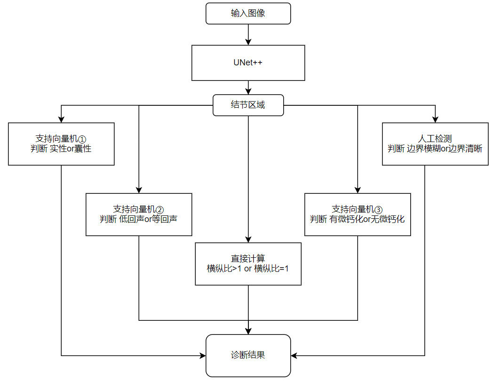
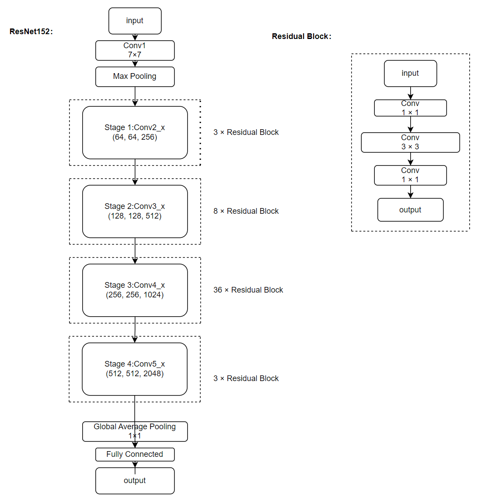

# <center>ThyroAssist</center>


## 介绍
ThyAssist(Thyroid Auxiliary Diagnostic Assistant)是一个跨平台的基于深度学习的甲状腺癌诊断系统。该系统能实现超声影像检测和显微镜下的甲状腺结节穿刺细胞的癌变检测，覆盖了甲状腺癌诊断的全流程。系统主要基于图像进行全局检测，也可以基于由fiji imagej软件采的的细胞特征进行单个细胞的检测。

 **超声影像分析模块** 采用深度学习与传统机器学习结合，人工检测和计算机辅助检测相结合的形式，首先使用UNet++网络分割出结节所在区域，再使用多个支持向量机和人工检测，对结节进行TI-RADS辅助评级，并生成文本形式的诊断建议。该模块架构如下：


 **病理影像分析模块** 使用ResNet152网络对显微镜下的甲状腺结节细针穿刺细胞进行深度特证提取，判断影像中的细胞为癌细胞还是正常细胞。ResNet152网络结构：



## 软件架构
软件架构说明

```
.
└── ThyroAssit

    ├── README.md
    ├── config                              # 参数配置
    │   ├── resnet18_cifar10_config.yaml
    │   ├── resnet18_cifar10_config_gpu.yaml
    │   ├── resnet18_imagenet2012_config.yaml
    │   ├── resnet18_imagenet2012_config_gpu.yaml
    │   ├── resnet34_imagenet2012_config.yaml
    │   ├── resnet50_cifar10_config.yaml
    │   ├── resnet34_cpu_config.yaml
    │   ├── resnet50_imagenet2012_Boost_config.yaml     # 高性能版本：性能提高超过10%而精度下降少于1%
    │   ├── resnet50_imagenet2012_Ascend_Thor_config.yaml
    │   ├── resnet50_imagenet2012_config.yaml
    │   ├── resnet50_imagenet2012_GPU_Thor_config.yaml
    │   ├── resnet101_imagenet2012_config.yaml
    │   ├── resnet152_imagenet2012_config.yaml
    │   └── se-resnet50_imagenet2012_config.yaml
    ├── scripts
    │   ├── nested_unet_ultrasound_image_infer_demo.sh            # 运行基于UNet++的超声影像分割
    │   ├── pylint_check.sh                                       # 运行pylint测试代码风格
    │   ├── resnet_pathological_image_classification_demo.sh      # 运行基于ResNet152的病理图片分类
    │   ├── single_cell_infer_demo.sh                             # 运行基于MLP的单甲状腺结节细针穿刺细胞特征分类
    │   ├── run_distribute_train_gpu.sh                           # 启动GPU分布式训练（8卡）
    │   ├── run_parameter_server_train_gpu.sh                     # 启动GPU参数服务器训练（8卡）
    │   ├── run_eval_gpu.sh                                       # 启动GPU评估
    │   ├── run_standalone_train_gpu.sh                           # 启动GPU单机训练（单卡）
    │   └── cache_util.sh                                         # 使用单节点緩存的帮助函数
    ├── src
    │   ├── data_split.py                      # 切分迁移数据集脚本（cpu）
    │   ├── dataset.py                         # 数据预处理
    │   ├── logger.py                          # 日志处理
    │   ├── callback.py                        # 训练时推理回调函数
    │   ├── util.py                            # 定义基础功能
    │   ├── CrossEntropySmooth.py              # ImageNet2012数据集的损失定义
    │   ├── lr_generator.py                    # 生成每个步骤的学习率
    │   ├── resnet.py                          # ResNet骨干网络，包括ResNet50、ResNet101和SE-ResNet50
    │   └── model_utils
    │       ├── config.py                       # 参数配置
    │       ├── device_adapter.py               # 设备配置
    │       ├── local_adapter.py                # 本地设备配置
    │       └── moxing_adapter.py               # modelarts设备配置
    ├── fine_tune.py                         # 迁移训练网络（cpu）
    ├── quick_start.py                       # quick start演示文件（cpu）
    ├── requirements.txt                     # 第三方依赖
    ├── eval.py                              # 评估网络
    ├── predict.py                           # 预测网络
    └── train.py                             # 训练网络
    
```


## 安装教程

### 1.  安装Anaconda3
 **以下两种方法二选一：** 

Anaconda3官方下载地址：https://www.anaconda.com/download 根据用户操作系统进行安装

清华镜像源下载地址：https://mirrors.tuna.tsinghua.edu.cn/anaconda/archive/ 根据用户操作系统选择合适的版本进行安装

安装完成后，创建Python版本为3.9-3.11的conda环境

```
conda create -n myenv python=3.11  # 这里以创建Python3.11的环境为例，"myenv"可换成其他名称
```

### 2.  安装Git

 **对于Windows：** 

Git官方下载地址：https://git-scm.com/downloads  选择Windows版进行安装（速度极慢，不推荐）

清华镜像源下载地址：https://mirrors.tuna.tsinghua.edu.cn/github-release/git-for-windows/git/Git%20for%20Windows%20v2.48.1.windows.1 选择合适的版本进行安装（速度较快，推荐）

 **对于linux**

输入如下命令：

```
sudo apt update
sudo apt install git
```
 **对于Mac** 

输入如下命令

```
brew -v
/bin/bash -c "$(curl -fsSL https://raw.githubusercontent.com/Homebrew/install/HEAD/install.sh)"
brew install git
```

### 3.  安装ThyroAssist

输入如下命令：

```
git clone https://github.com/ShangJingLi/ThyroAssist.git  # 目前暂未开源，需要密码才能克隆
cd ThyroAssist
conda activate myenv  # "myenv"是希望安装本项目的环境
pip install .
```

 _注意：自动安装的mindspore仅支持CPU，若需要使用GPU或昇腾芯片加速，请参考mindspore官网的安装教程：https://www.mindspore.cn/install GPU加速建议使用Mindspore 2.2.14，Python版本选择Python3.9_ 


## 使用说明

### 1.  检验是否安装成功

命令行输入
```
conda activate myenv  # 激活安装本项目的conda环境，若已激活则忽略本命令
thyassist -h
```

若输出
```
usage: thyassist [-h] {pathology,ultrasound,single_cell} ...

ThyroAssist 命令行工具

positional arguments:
  {pathology,ultrasound,single_cell}
                        子命令
    pathology           运行病理分析 demo
    ultrasound          运行超声分析 demo
    single_cell         运行单细胞分析 demo

options:
  -h, --help            show this help message and exit
```
则安装成功

### 2.启动超声影像分析模块

命令行输入

```
conda activate myenv  # 激活安装本项目的conda环境，若已激活则忽略本命令
thyassist ultrasound
```

等待片刻后，若浏览器显示如下界面，则启动成功：


 _注意：本模块初次启动需要下载模型文件，故初次启动较慢_ 


### 3.启动病理影像分析模块

命令行输入

```
conda activate myenv  # 激活安装本项目的conda环境，若已激活则忽略本命令
thyassist pathology
```

等待片刻后，若浏览器显示如下界面，则启动成功：


 _注意：本模块初次启动需要下载模型文件，故初次启动较慢_ 

### 4.启动单细胞特征分析模块

命令行输入

```
conda activate myenv  # 激活安装本项目的conda环境，若已激活则忽略本命令
thyassist single_cell
```

等待片刻后，若浏览器显示如下界面，则启动成功：


## 参与贡献

1.  Fork 本仓库
2.  新建 Feat_xxx 分支
3.  提交代码
4.  新建 Pull Request


## 其他说明

联系人：李尚憬

联系邮箱: 1755397894@qq.com

启智社区个人主页：https://openi.pcl.ac.cn/enter (本项目所用数据集和模型均托管于此)

